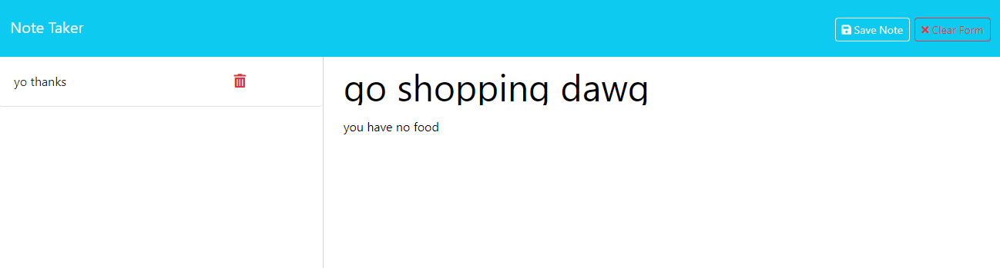

# 11 Express.js: Note Taker

## Description
  
This application allows you to easily take notes and save them online.
  
## Table of Contents (Optional)
  
 - [Installation](#installation)
 - [Usage](#usage)
 - [Credits](#credits)
 - [Features](#features)
 - [Questions](#questions)
  
## Installation
  
No installation needed, this application runs in your browser!
  
## Usage
  
To use this application, click [here](https://c11-note-taker.onrender.com/) and select "Get Started". From here you're able to enter a title for your note, and a body, 
which allows you to save and/or delete the note once you're finished.

Example:

  
## Credits
  
Shouts out to our mini-project from the Express module and Dan for letting us know we could use it!

Whoever wrote the starter code for this.

And of course, Ian Wolfe.
  
## Features
  
This project features express and by extension node.

## Questions

For any questions about this project, please visit my [GitHub](https://github.com/enkw).
